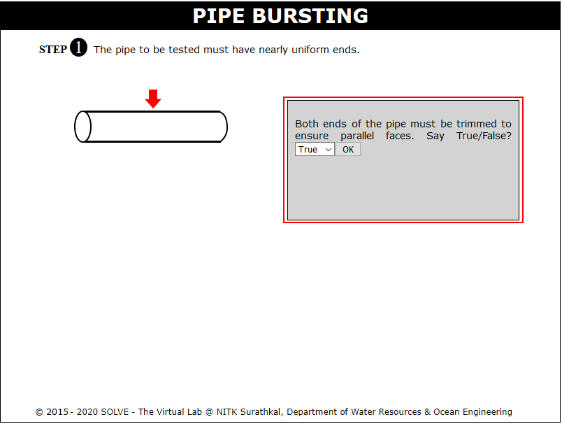
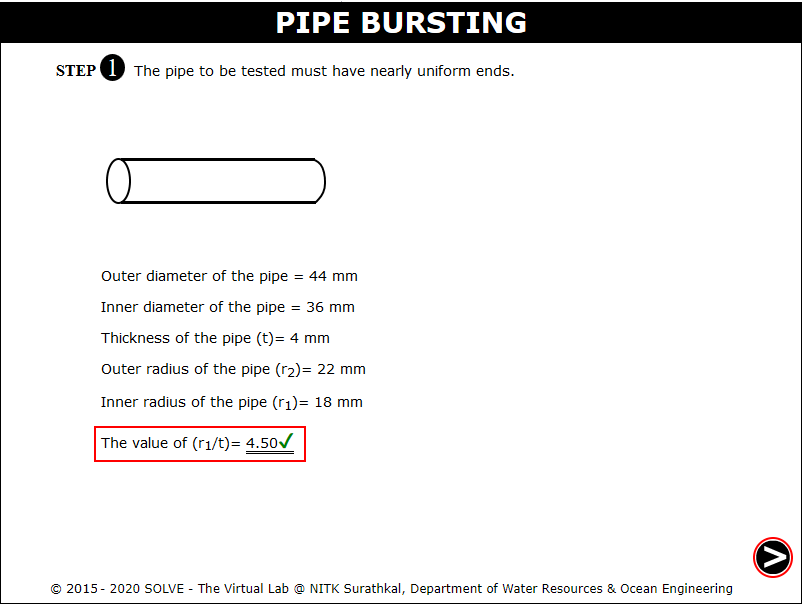
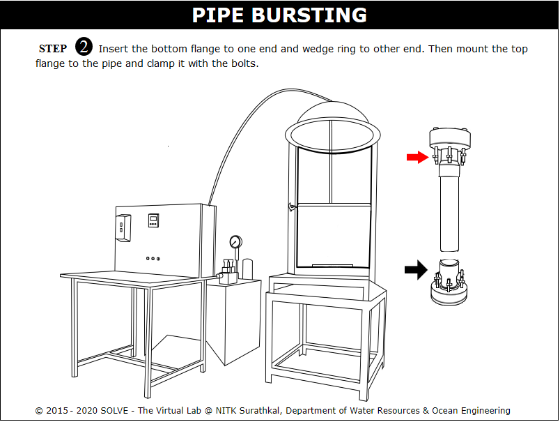
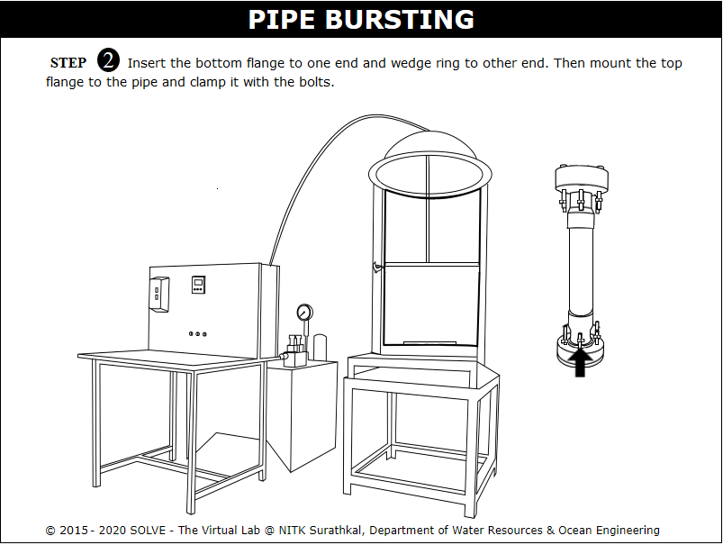
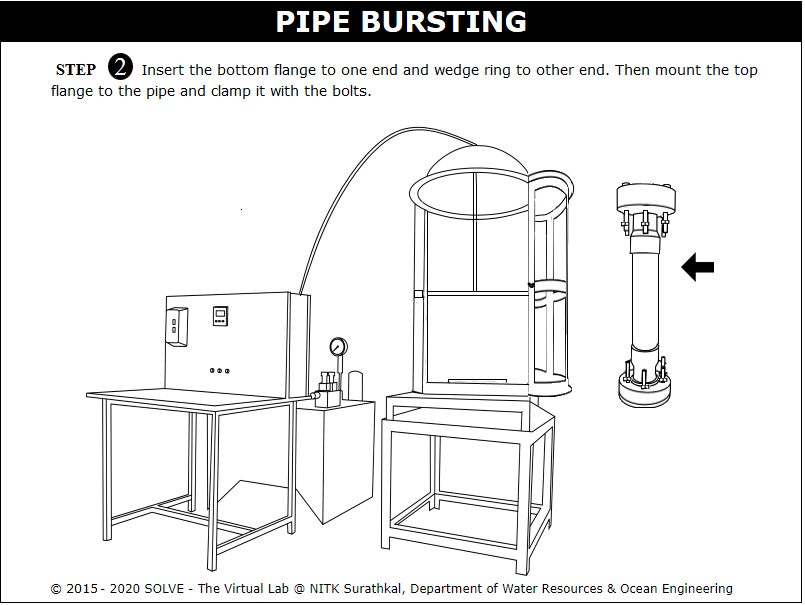
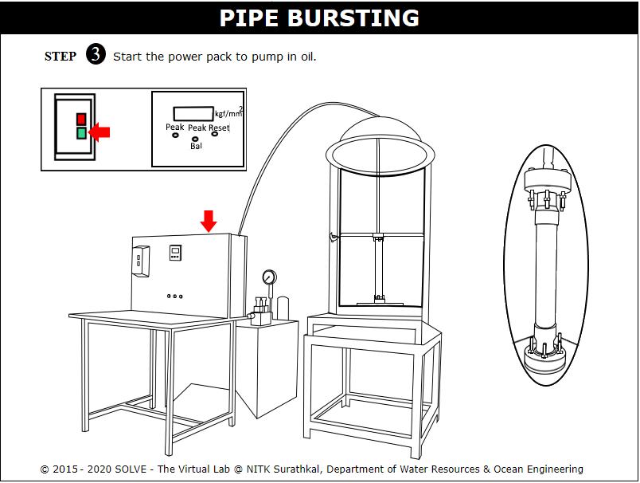
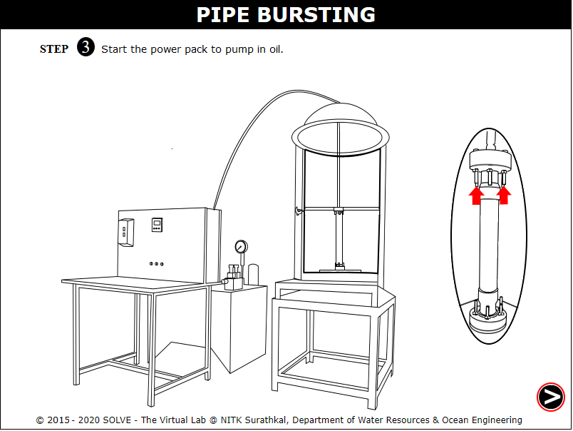
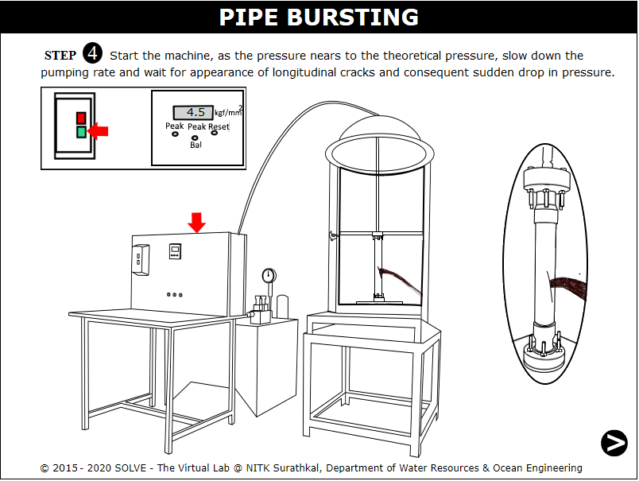
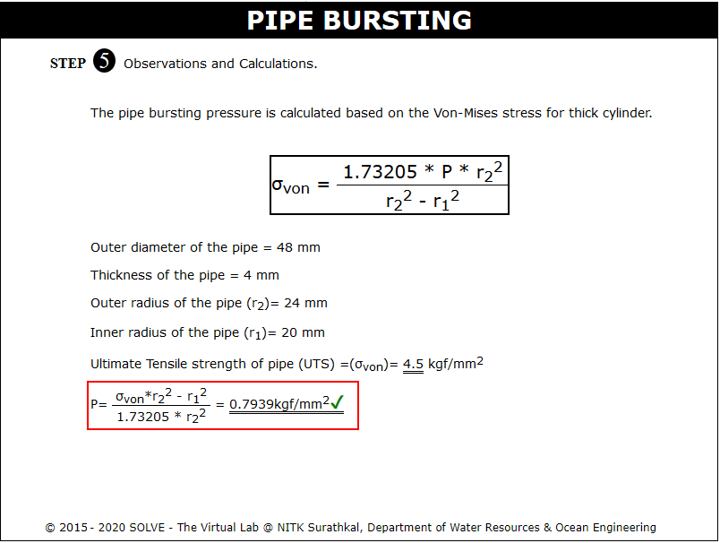

#### These procedure steps will be followed on the simulator

1. Open the Pipe Bursting experiment and click on the NEXT button shown at the bottom right corner and also description provided. 
 

2. Click on the pipe to check for uniform ends and answer the question displayed. 
 

3. Note down the dimensions of the pipe, click NEXT button to proceed. 
 

4. Click on flanges to mount it on the pipe. 
 

5. Click on the vent bolt to tighten them. 
 

6. Click on the pipe assembly to place it on the test platform and click NEXT button to proceed. 
 

7. Click on the green button to start pumping the oil and then click on the red button to stop. 
 

8. Click on the top bolt to avoid leak and click NEXT button to proceed. 
 

9. Click on the green button to start the machine and apply pressure until longitudinal cracks appaer, click NEXT button to proceed. 
 

10. Calculate the pipe bursting pressure from the observation. 
 
