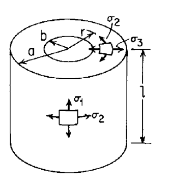

### INTRODUCTION 

The pipelines carrying water, sewage or other natural gas needs proper investigation to avoid leakage of the substance from the pipe. The pressure exerted by the flowing liquids/ gas inside the pipe and its purpose decides the size and strength of the pipe need to be used. In the service time, the pipe may undergo severe pressure depending upon the purpose of use. It should have sufficient strength to withstand the maximum pressure acting on it without failure. The pipe mainly needs to be tested for its working pressure and bursting pressure.

<ul style="text-indent:50px;text-align:justify;list-style-position: inside">
<li>Working pressure is the maximum allowable pressure a pipe may be subjected to while in-service.</li>
<li>Burst pressure is the pressure that a pressure vessel like pipe or tube can handle before rupturing or “bursting”. It is the minimum pressure that causes irreversible damage on the pipe by bursting.</li>
</ul>

The test is carried out by sending oil pressure from the pipe. It induces three types of pressure on the pipe i.e., normal stress in longitudinal direction, in circumferential direction and in radial direction. From these three stresses, Von-Mises stress is computed. In order to find the bursting pressure, the Von-Mises stress is equated to the ultimate tensile strength of the material at a given temperature.

  

Pipe Showing Induced Stress when Subjected to Internal Pressure
 

Source: (<a href="https://physics.stackexchange.com/questions/297369/calculation-of-longitudinal-stress-in-a-pipe-segment ">https://physics.stackexchange.com/questions/297369/calculation-of-longitudinal-stress-in-a-pipe-segment </a>)

